# Lab – React Client for Blueprints (Redux + Axios + JWT)
# Rafael Moreno - Sebastian Castillejo

> Basado en el cliente HTML/JS del repo de referencia, este laboratorio moderniza el _frontend_ con **React + Vite**, **Redux Toolkit**, **Axios** (con interceptores y JWT), **React Router** y pruebas con **Vitest + Testing Library**.

## Objetivos de aprendizaje

- Diseñar una SPA en React aplicando **componetización** y **Redux (reducers/slices)**.
- Consumir APIs REST de Blueprints con **Axios** y manejar **estados de carga/errores**.
- Integrar **autenticación JWT** con interceptores y rutas protegidas.
- Aplicar buenas prácticas: estructura de carpetas, `.env`, linters, testing, CI.

## Requisitos previos

- Tener corriendo el backend de Blueprints de los **Labs 3 y 4** (APIs + seguridad).
- Node.js 18+ y npm.

Ver la especificación de glosario clave, consulta las [Definiciones del laboratorio](./DEFINICIONES.md).

## Endpoints esperados (ajústalos si tu backend quedo diferente)

- `GET /api/blueprints` → lista general o catálogo para derivar autores.
- `GET /api/blueprints/{author}`
- `GET /api/blueprints/{author}/{name}`
- `POST /api/blueprints` (requiere JWT)
- `POST /api/auth/login` → `{ token }`

Configura la URL base en `.env`.

## Cómo arrancar

```bash
npm install
cp .env.example .env
# edita .env con la URL del backend
npm run dev
```

Abre `http://localhost:5173`

## Variables de entorno

Crea un archivo `.env` en la raíz:

```variable
VITE_API_BASE_URL=http://localhost:8080/api
```

> **Tip:** en producción usa variables seguras o un _reverse proxy_.

## Estructura

```carpetas
blueprints-react-lab/
├─ src/
│  ├─ components/
│  ├─ features/blueprints/blueprintsSlice.js
│  ├─ pages/
│  ├─ services/apiClient.js   # axios + interceptores JWT
│  ├─ store/index.js          # Redux Toolkit
│  ├─ App.jsx, main.jsx, styles.css
├─ tests/
├─ .github/workflows/ci.yml
├─ index.html, package.json, vite.config.js, README.md
```

## 📌 Requerimientos del laboratorio

## 1. Canvas (lienzo)

- Agregar un lienzo (Canvas) a la página.

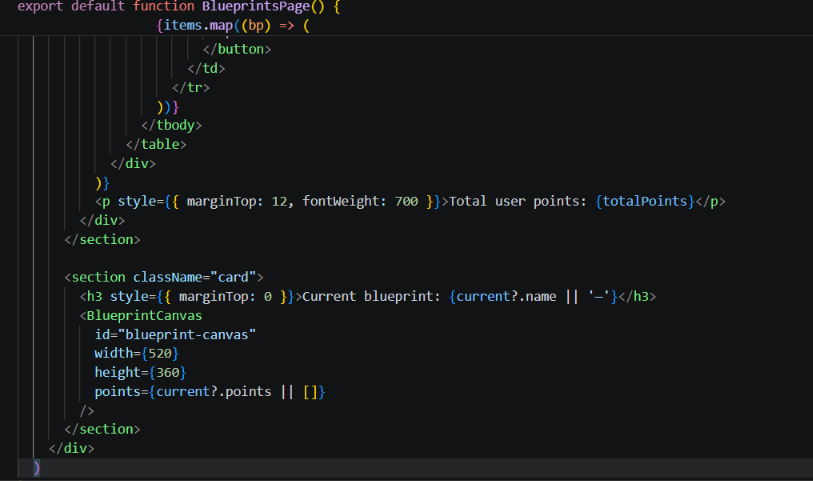

En la página principal agregamos el lienzo dentro de la tarjeta "Current blueprint", Ahí se van a dibujar los planos cuando el usuario abra uno de la lista.

- Incluir un componente `BlueprintCanvas` con un identificador propio.

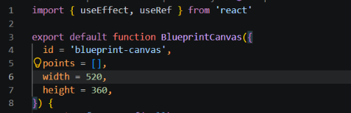

Este es el componente BlueprintCanvas, que se encarga de mostrar el lienzo. Le agregamos un identificador propio llamado blueprint-canvas, que ya viene puesto por defecto. Así el lienzo tiene un nombre único para reconocerlo.

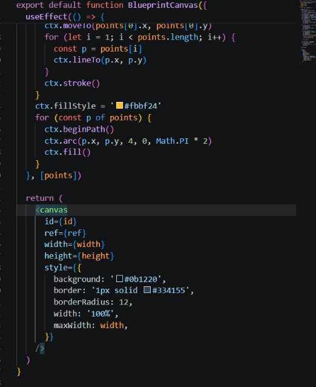

Aquí el identificador se le pone al lienzo de verdad id={id}. Esta parte también dibuja las líneas que unen los puntos del plano y marca cada punto con un círculo amarillo.

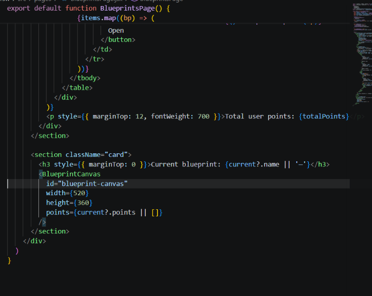

Cuando usamos el componente en la página, le pasamos el identificador blueprint-canvas. Así queda claro qué lienzo es el que se está usando.

- Definir dimensiones adecuadas para que no ocupe toda la pantalla pero permita dibujar los planos.

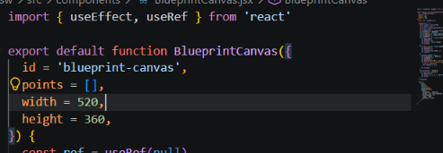

Dejamos definido que el lienzo mide 520 de ancho por 360 de alto si no se le indica otro tamaño. Es un tamaño que deja buen espacio para dibujar sin ocupar toda la pantalla.

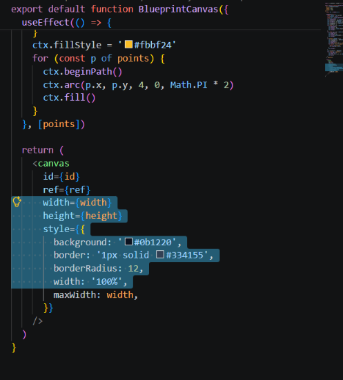

Aquí se le aplican al lienzo el ancho y el alto, junto con un poco de estilo: fondo oscuro, borde y esquinas redondeadas. El límite maxWidth hace que no crezca más de 520, y si la pantalla es pequeña se ajusta solo.

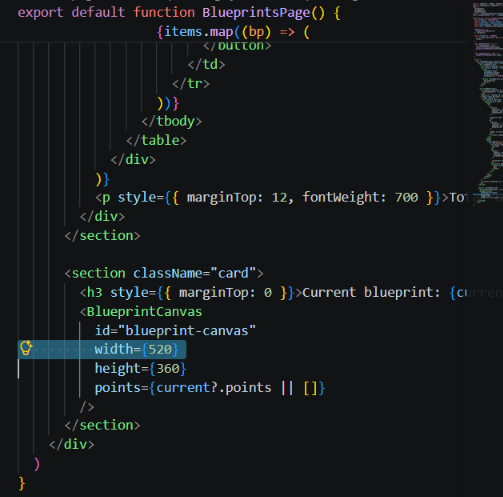

En la página le indicamos al lienzo el tamaño de 520×360. Así se ve bien dentro de la tarjeta, acompañado de la tabla de planos al lado.

## 2. Listar los planos de un autor

- Permitir ingresar el nombre de un autor y consultar sus planos desde el backend (o mock).

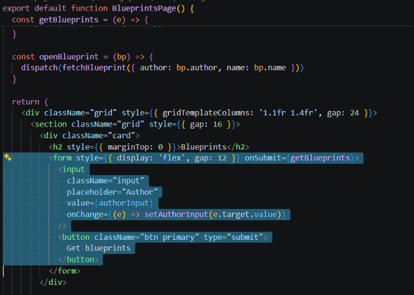

Aquí está el cuadro donde se escribe el nombre del autor y el botón Get blueprints para buscar sus planos. También funciona presionando Enter.

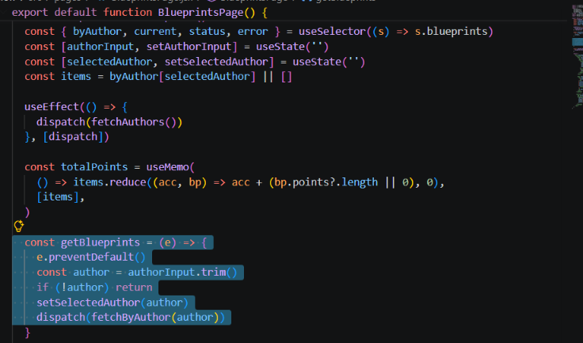

Esto es lo que pasa al presionar el botón: se toma el nombre que escribió el usuario, se quitan los espacios de sobra y se piden los planos de ese autor.

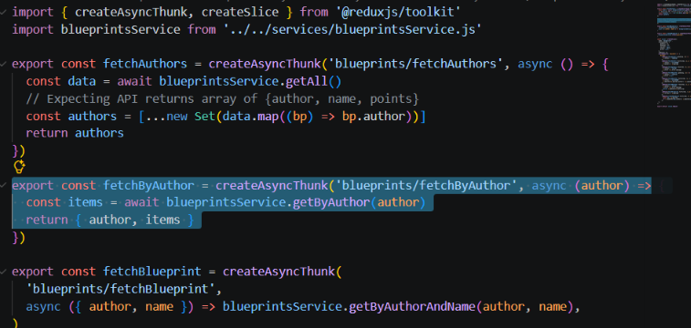

Esta parte se encarga de ir a buscar los planos del autor y devolverlos para mostrarlos en la página.

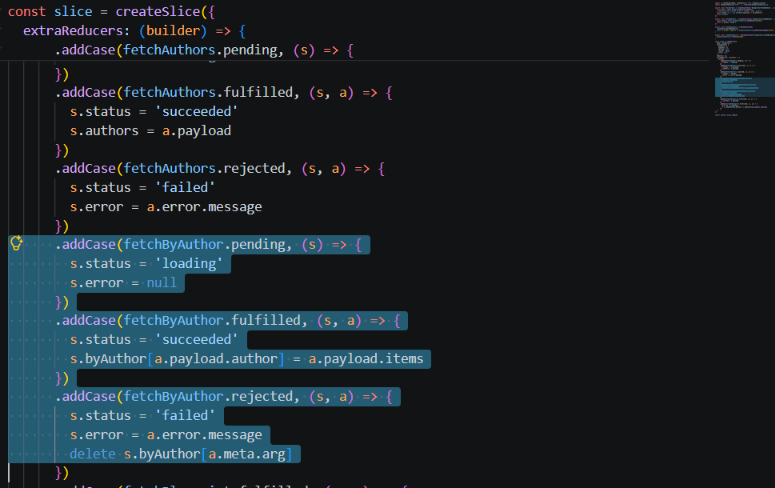

Aquí se guarda en qué si está cargando, si ya llegaron los planos o si hubo un error. Así la página sabe qué mensaje mostrar.

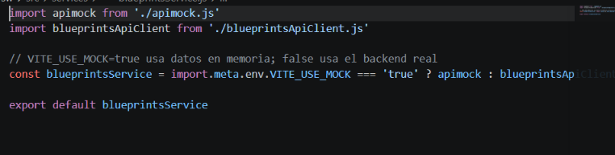

Este archivo decide de dónde salen los datos. Si está activado el modo de prueba, usa datos inventados. Si no, los pide al servidor real.

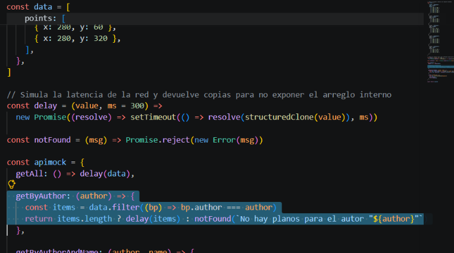

Estos son los datos de prueba. Aquí se buscan los planos del autor y, si no tiene ninguno, se avisa con un mensaje.

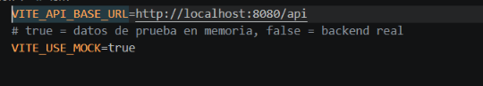

En este archivo se activa el modo de prueba poniendo VITE_USE_MOCK en true. Así la aplicación funciona sin tener el servidor prendido.

- Mostrar los resultados en una tabla con las siguientes columnas:
  - Nombre del plano
  - Número de puntos
  - Botón `Open` para abrirlo

  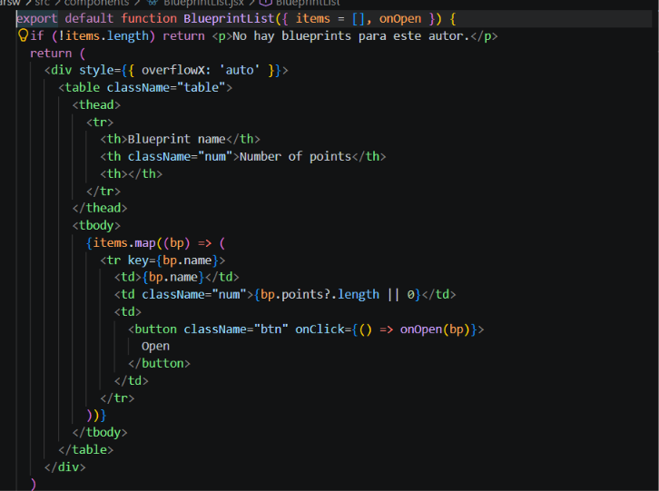

  Esta es la tabla donde se muestran los planos. Tiene tres columnas: el nombre del plano, cuántos puntos tiene y un botón Open para abrirlo.

  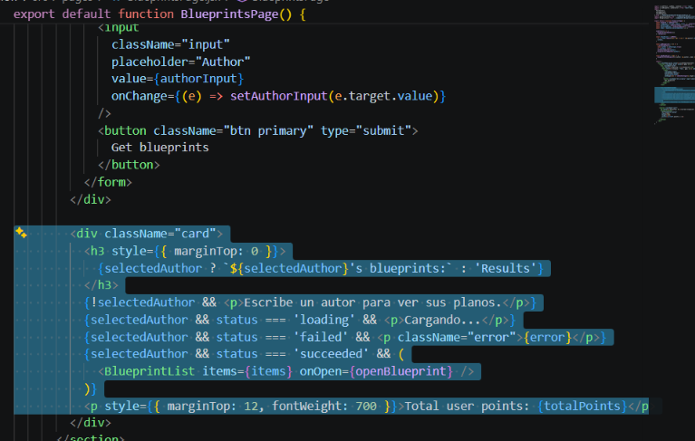

  Aquí se muestra la tabla en la página. Mientras busca aparece "Cargando...", si hay un error se muestra en rojo y si todo sale bien aparece la tabla con los planos.

  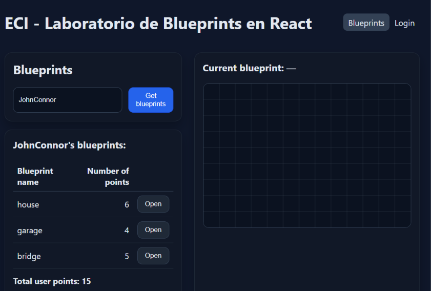

  Buscando a JohnConnor aparecen sus tres planos, cada uno con su número de puntos y su botón Open. Abajo sale el total de puntos.

  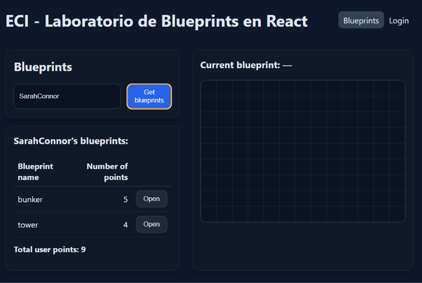

  Buscando a SarahConnor aparecen sus dos planos, bunker y tower. Así se ve que la tabla cambia según el autor que se escriba.

  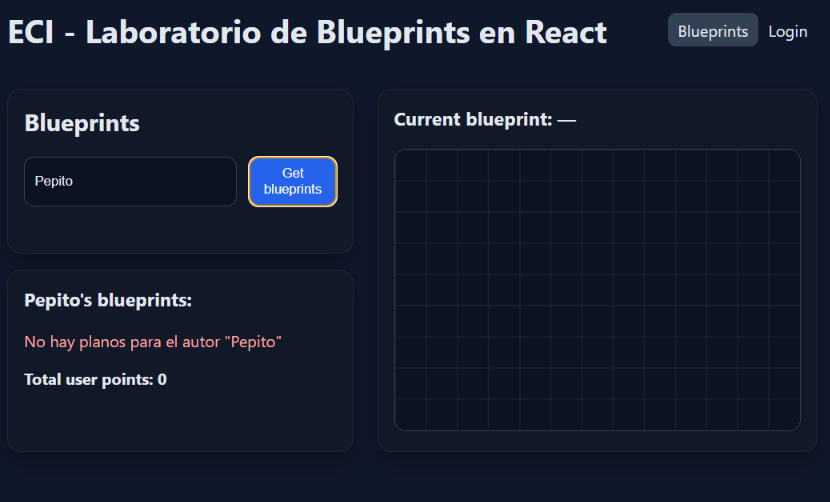

  Si se busca un autor que no existe, como Pepito, aparece un mensaje en rojo avisando que no tiene planos.
  

## 3. Seleccionar un plano y graficarlo

Al hacer clic en el botón `Open`, debe:

- Actualizar un campo de texto con el nombre del plano actual.

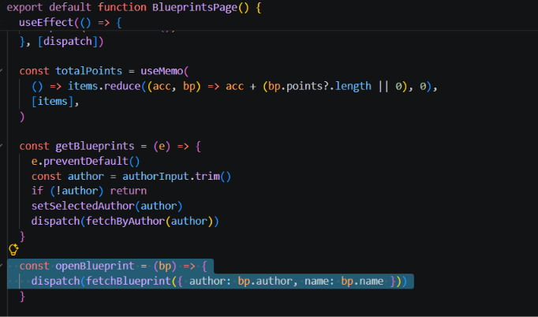

Esto es lo que pasa al dar clic en Open. Se toma el autor y el nombre del plano de esa fila y se pide abrir ese plano.

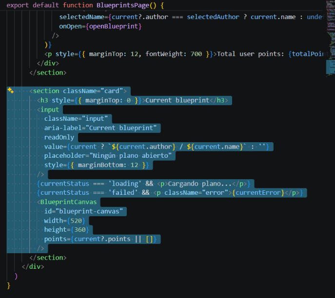

Aquí está el campo de texto que muestra el plano que está abierto, con el autor y el nombre. Si todavía no se ha abierto ninguno dice que no hay plano abierto. Debajo va el lienzo donde se dibuja.

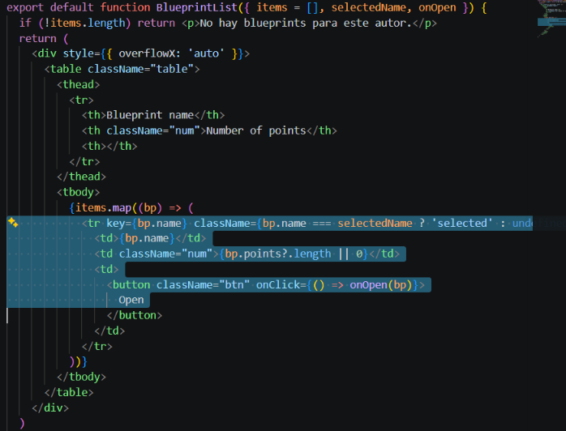

En la tabla cada fila tiene su botón Open, que es el que abre el plano. La fila del plano abierto se resalta para saber cuál se está viendo.

- Obtener los puntos del plano correspondiente.

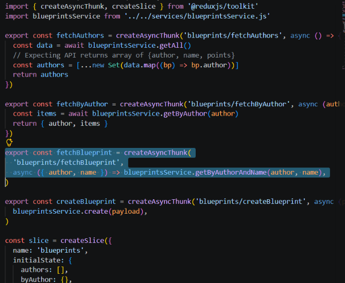

Esta parte se encarga de pedir el plano usando el autor y el nombre, y así obtener sus puntos.

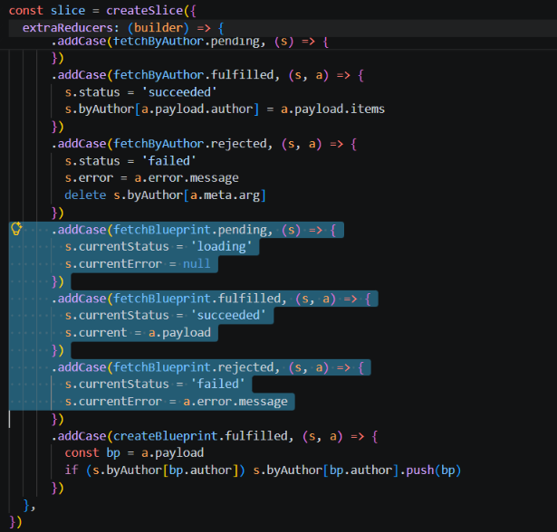

Aquí se guarda el plano que se abrió junto con sus puntos. También se guarda si está cargando o si hubo un error, para avisarle al usuario.

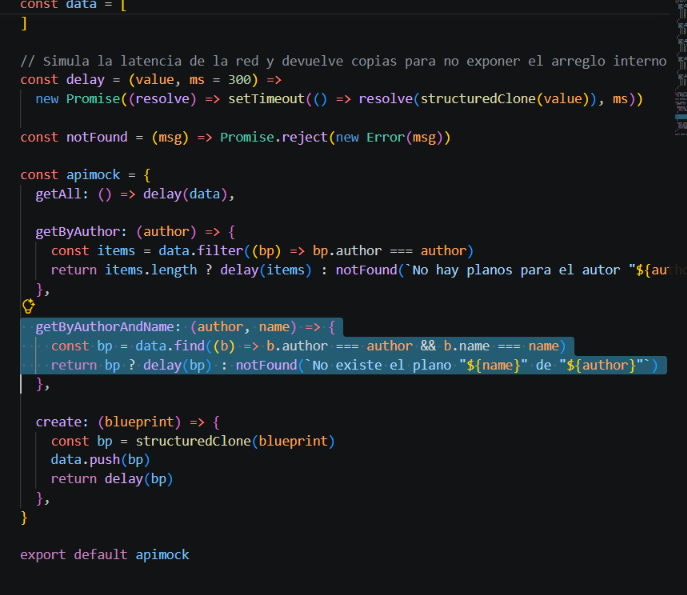

En los datos de prueba se busca el plano que tenga ese autor y ese nombre. Si no existe se avisa con un mensaje.

- Dibujar consecutivamente los segmentos de recta en el canvas y marcar cada punto.

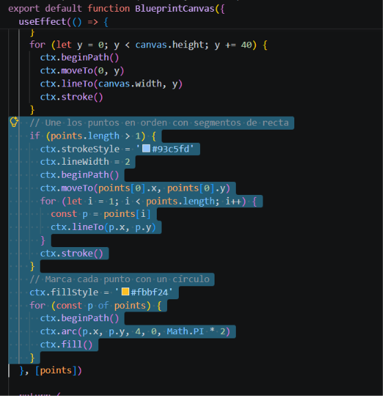

Esta es la parte que dibuja. Primero une los puntos en orden con líneas rectas, del primero al segundo, del segundo al tercero y así. Después marca cada punto con un círculo amarillo.

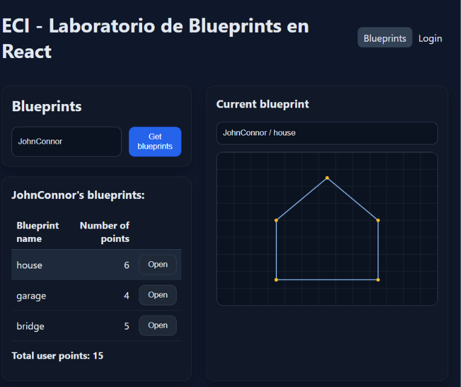

Así se ve al abrir el plano house de JohnConnor. El campo de texto muestra el nombre, la fila queda resaltada en la tabla y en el lienzo aparece la casa dibujada con sus puntos marcados.

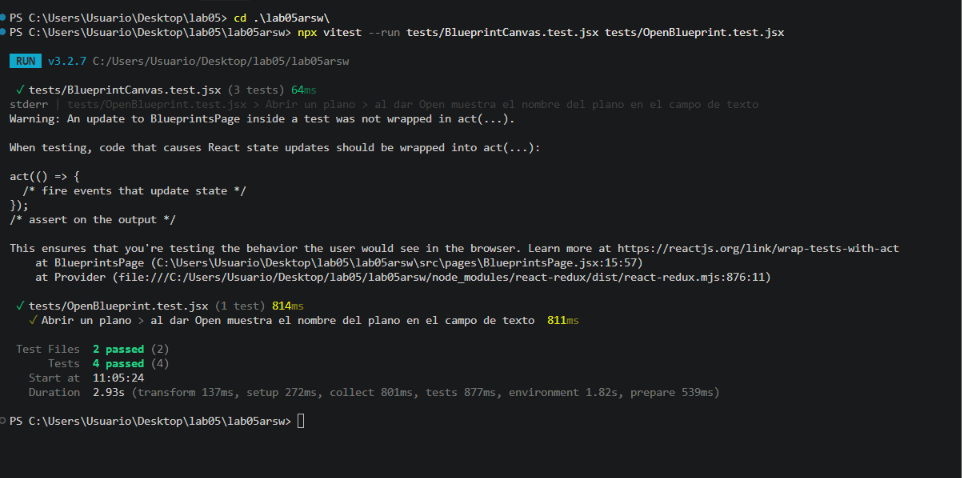

Aquí se corren las pruebas del lienzo y de abrir un plano, y todas pasan. Se revisa que las líneas se dibujen en orden, que cada punto quede marcado y que al dar Open se muestre el nombre del plano.

## 4. Servicios: `apimock` y `apiclient`

- Implementar dos servicios con la misma interfaz:
  - `apimock`: retorna datos de prueba desde memoria.
  - `apiclient`: consume el API REST real con Axios.
- La interfaz de ambos debe incluir los métodos:
  - `getAll`
  - `getByAuthor`
  - `getByAuthorAndName`
  - `create`

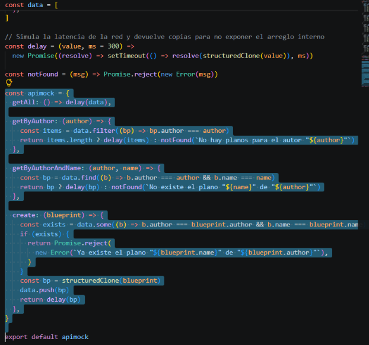

Este es el servicio de prueba. Tiene los planos guardados en memoria y los cuatro métodos que pide el laboratorio, que son traer todos, traer los de un autor, traer uno por autor y nombre, y crear uno nuevo. Si se intenta crear un plano que ya existe avisa con un mensaje.

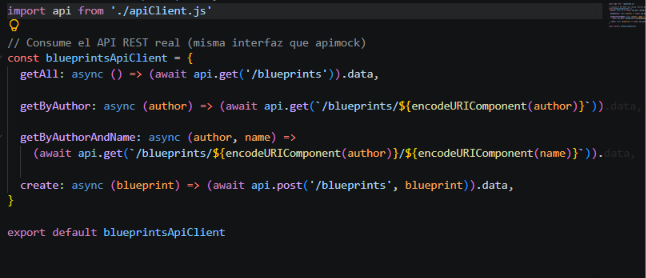

Este es el servicio que se conecta al servidor real usando Axios. Tiene los mismos cuatro métodos que el de prueba, así que la aplicación los puede usar igual sin importar cuál esté activo.

- Habilitar el cambio entre `apimock` y `apiclient` con una sola línea de código:
  - Definir un módulo `blueprintsService.js` que importe uno u otro según una variable en `.env`.
  - Ejemplo en `.env` (Vite):

```env
VITE_USE_MOCK=true
```

- `VITE_USE_MOCK=true` usa el mock.
- `VITE_USE_MOCK=false` usa el API real.


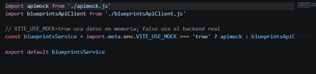

Este archivo es el que decide cuál servicio usar. Con una sola línea revisa la variable VITE_USE_MOCK y según su valor usa los datos de prueba o el servidor real.

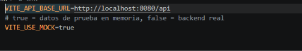

En el archivo .env se pone VITE_USE_MOCK en true para usar los datos de prueba.

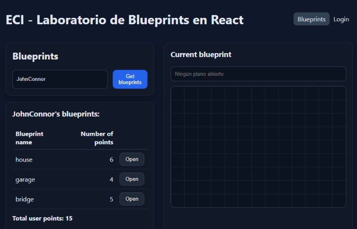

Con VITE_USE_MOCK en true, al buscar a JohnConnor aparecen sus planos porque salen de los datos de prueba.

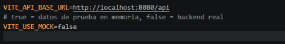

Aquí se cambió VITE_USE_MOCK a false para que la aplicación use el servidor real.

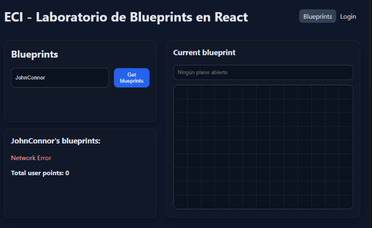

Con VITE_USE_MOCK en false, al buscar a JohnConnor sale un error porque el servidor no está prendido. Esto demuestra que la aplicación ahora sí intenta conectarse al servidor real.

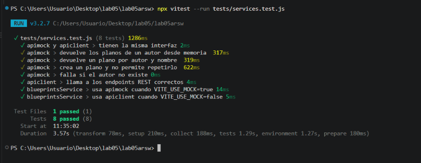

Aquí se corren las pruebas de los servicios y todas pasan. Se revisa que los dos servicios tengan los mismos métodos, que el de prueba funcione bien, que el real llame a las direcciones correctas y que se use uno u otro según la variable del .env.

## 5. Interfaz con React

- El nombre del plano actual debe mostrarse en el DOM como parte del estado global (Redux).

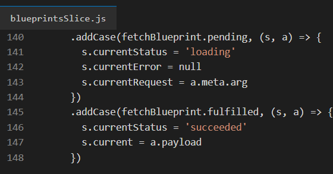

Cuando se abre un plano, el resultado se guarda en Redux, en el campo current. Ahí quedan el autor, el nombre y los puntos.

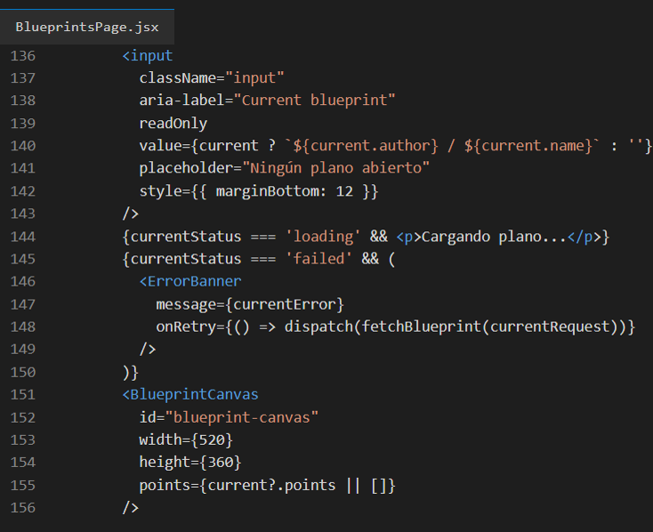

El campo de texto toma su valor de current y muestra el autor y el nombre. Si todavía no hay un plano abierto, el campo queda vacío y se ve "Ningún plano abierto". Los puntos de ese mismo dato se le pasan al lienzo.

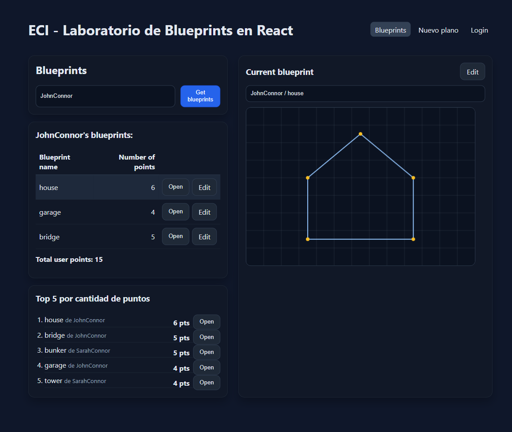

Al abrir house de JohnConnor, el campo muestra JohnConnor / house, que es lo que quedó guardado en el estado. La fila de house queda resaltada y el lienzo dibuja ese plano.

- Evitar manipular directamente el DOM; usar componentes y props/estado.

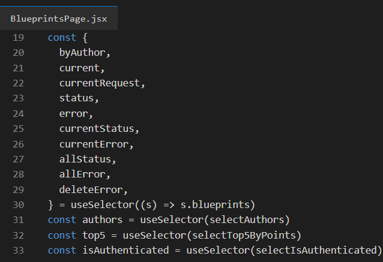

La página toma los datos del estado global con useSelector. De ahí salen current, la lista de planos y los mensajes de carga o error.

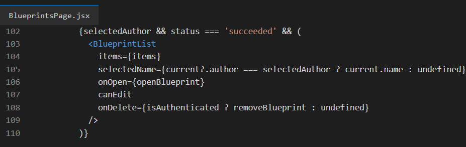

Esos datos se pasan a los componentes por props. La tabla recibe los planos, el nombre del que está abierto y la función para abrirlo. El lienzo recibe los puntos.

## 6. Estilos

- Agregar estilos para mejorar la presentación.

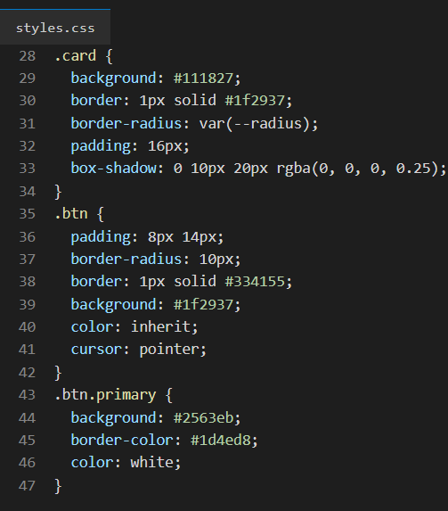

Los estilos están en styles.css. La clase card arma las tarjetas y la clase btn arma los botones. El botón Get blueprints usa btn primary.

- Se puede usar Bootstrap u otro framework CSS.

El archivo styles.css tiene las clases de las tarjetas, los botones y la tabla, y con eso se arma la presentación de la página.

- Ajustar la tabla, botones y tarjetas para acercarse al mock de referencia.

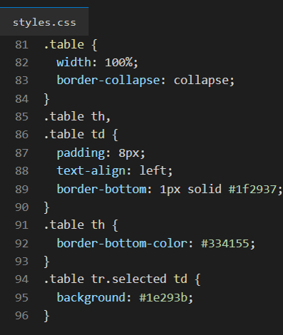

La tabla ocupa el ancho de la tarjeta, separa las filas y resalta la del plano que está abierto.


Así queda la página. La búsqueda, la tabla y el plano abierto van en tarjetas. Los botones se distinguen y la fila de house, que es el plano abierto, queda marcada.

## 7. Pruebas unitarias

- Agregar pruebas con Vitest + Testing Library para validar:
  - Render del canvas.
  - Envío de formularios.
  - Interacciones básicas con Redux (por ejemplo: dispatch de `fetchByAuthor`).

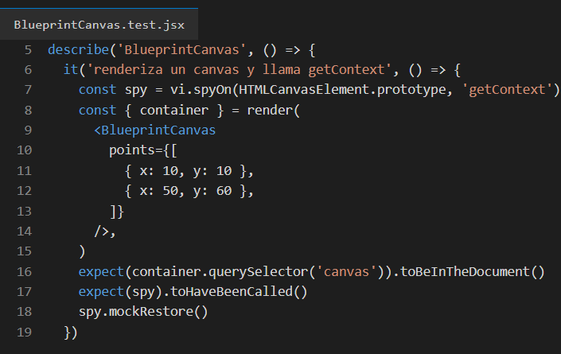

Esta prueba monta el lienzo y revisa que el canvas aparezca en la página.

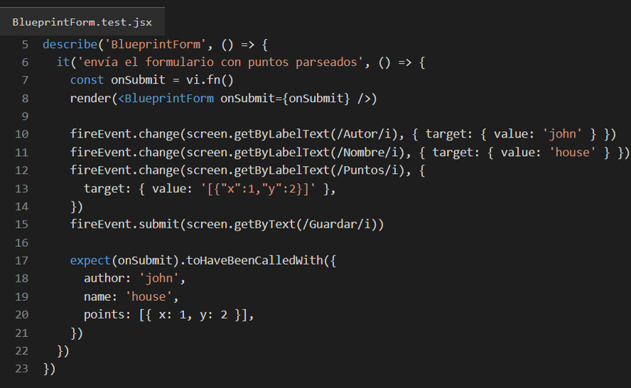

Esta prueba escribe el autor, el nombre y los puntos, envía el formulario y revisa que esos datos lleguen al guardar.

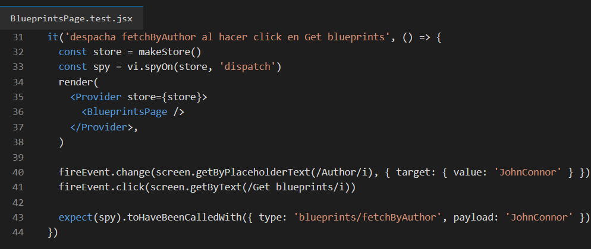

Esta prueba escribe un autor, da clic en Get blueprints y revisa que se dispare fetchByAuthor con ese nombre.

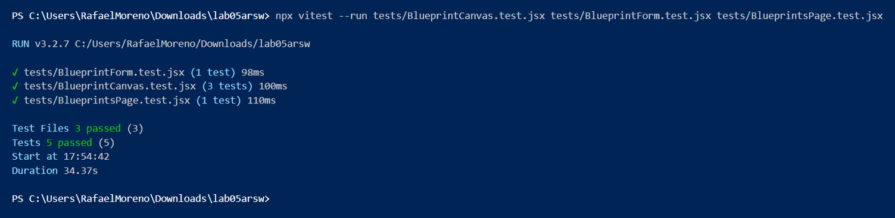

Al correr esas pruebas pasan las del lienzo, la del formulario y la de la página.

---

### Notas rápidas y recomendaciones

- Para el canvas en tests con jsdom: agregar un mock de `HTMLCanvasElement.prototype.getContext` en `tests/setup.js`.
- Para usar `@testing-library/jest-dom` con Vitest: en `tests/setup.js` importar `import '@testing-library/jest-dom'` y asegurarse de que Vitest provea el global `expect` (configurar `vitest.config.js` con la opción `test: { globals: true, setupFiles: './tests/setup.js' }`).
- Para la conmutación de servicios en Vite, usar `import.meta.env.VITE_USE_MOCK` para leer la variable en tiempo de ejecución.

## 📌 Recomendaciones y actividades sugeridas para el exito del laboratorio

1. **Redux avanzado**
   - [ ] Agrega estados `loading/error` por _thunk_ y muéstralos en la UI.

   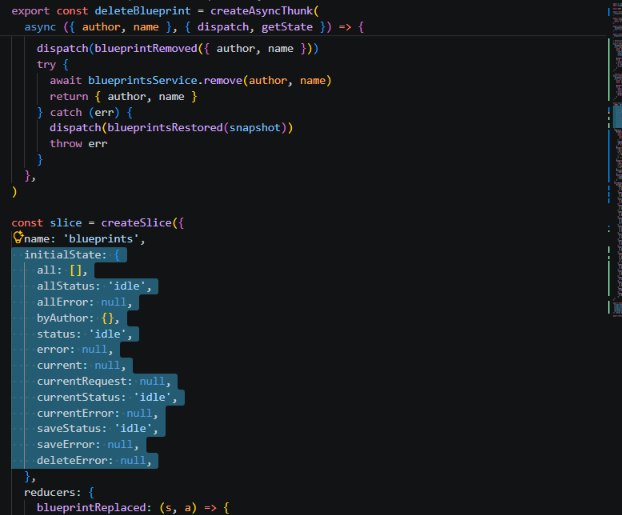

   Aquí se ve que cada consulta tiene su propio estado de carga y su propio error. Hay uno para la lista de todos los planos, otro para los planos de un autor, otro para el plano abierto, otro para guardar y otro para borrar. Así un error en una parte no daña las demás.

   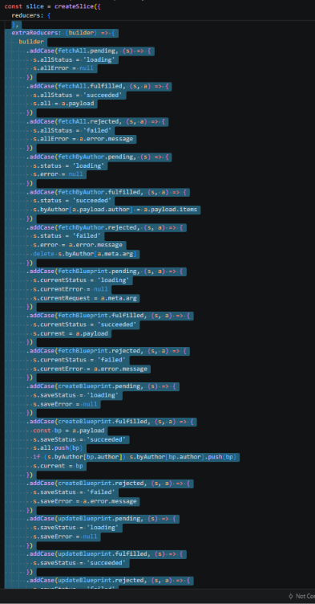

   Para cada consulta se guarda si está cargando, si terminó bien o si falló. Cuando falla se guarda el mensaje del error para mostrarlo en la página.

   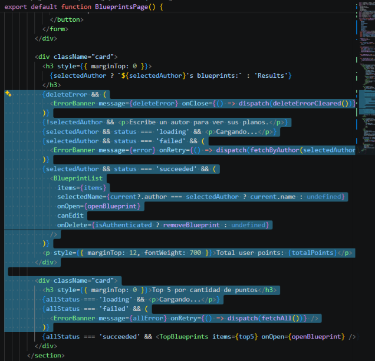

   En la página se muestra el estado de cada consulta. Mientras carga aparece "Cargando..." y si falla aparece un aviso rojo con el error.

   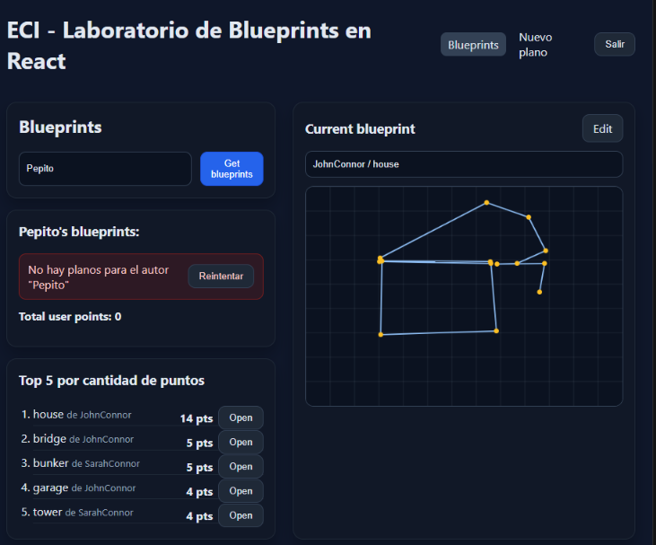

   Al buscar a Pepito sale el error de esa búsqueda, pero el top 5 y el plano abierto siguen funcionando normal. Esto muestra que cada consulta maneja su propio error.

   - [ ] Implementa _memo selectors_ para derivar el top-5 de blueprints por cantidad de puntos.

   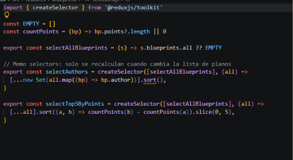

   Estos son los memo selectors. Uno saca la lista de autores sin repetir y otro saca los 5 planos con más puntos. Solo se vuelven a calcular cuando cambia la lista de planos, así no se repite el trabajo cada vez que la página se actualiza.

   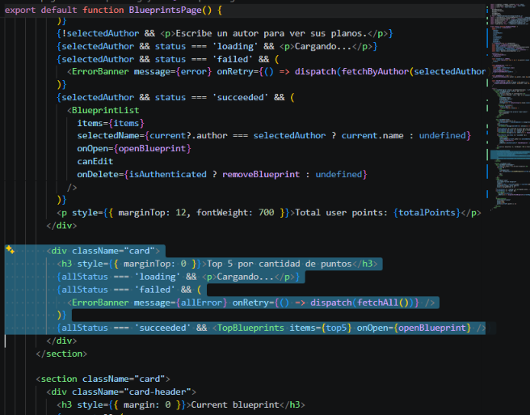

   Aquí se muestra la tarjeta del top 5 en la página. Mientras carga dice "Cargando..." y si falla sale un aviso con el botón Reintentar.

   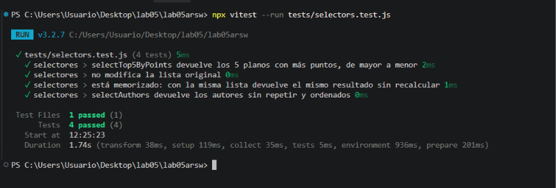

   Las pruebas de los selectores pasan. Se revisa que el top 5 salga de mayor a menor, que no cambie la lista original, que no se vuelva a calcular si la lista es la misma y que los autores salgan sin repetir.

2. **Rutas protegidas**
   - [ ] Crea un componente `<PrivateRoute>` y protege la creación/edición.

   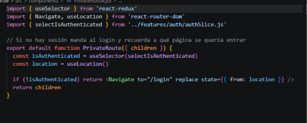

   Este es el componente PrivateRoute. Si el usuario no ha iniciado sesión lo manda a la página de login y recuerda a qué página quería entrar.

   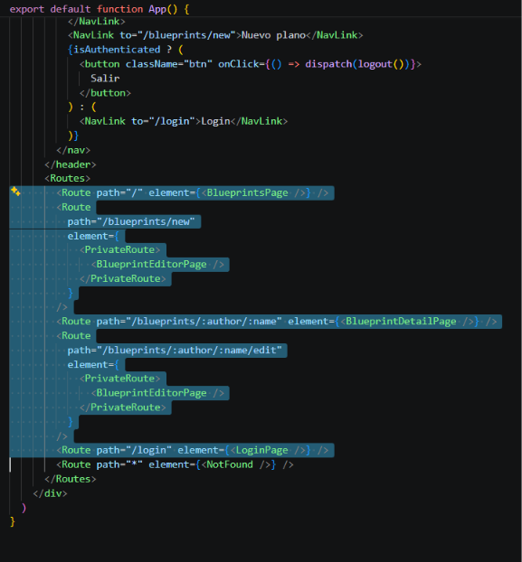

   En las rutas de la aplicación, la de crear un plano nuevo y la de editar quedan dentro de PrivateRoute. Así solo se puede entrar a ellas con la sesión iniciada.

   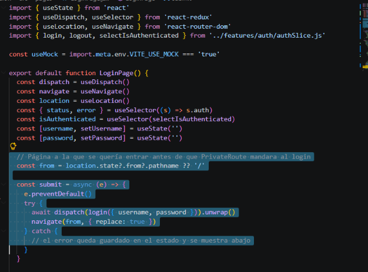

   En el login, cuando el usuario entra bien, se le devuelve a la página que quería ver antes de que lo mandaran a iniciar sesión.

   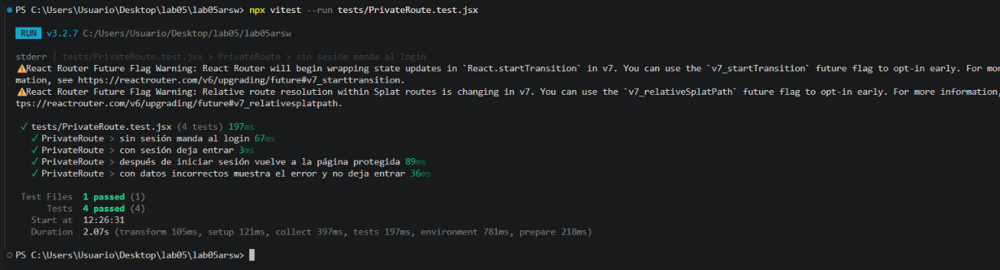

   Las pruebas de PrivateRoute pasan. Se revisa que sin sesión mande al login, que con sesión deje entrar, que después de iniciar sesión vuelva a la página protegida y que con datos incorrectos no deje entrar.

3. **CRUD completo**
   - [ ] Implementa `PUT /api/blueprints/{author}/{name}` y `DELETE ...` en el slice y en la UI.

   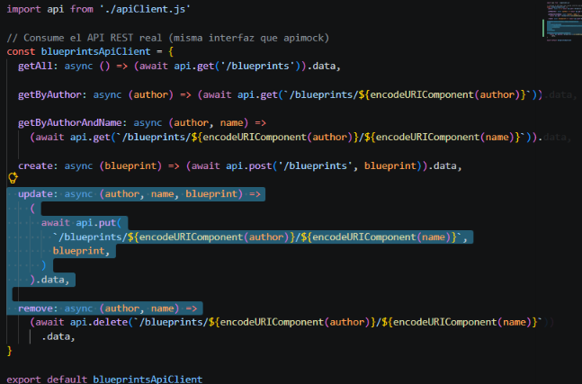

   En el servicio que se conecta al servidor real se agregaron update y remove. El primero usa PUT para actualizar un plano y el segundo usa DELETE para borrarlo.

   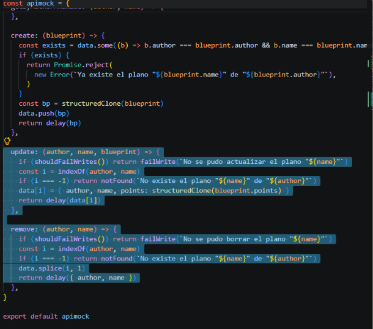

   En el servicio de prueba también se agregaron update y remove, para que funcione igual sin tener el servidor prendido.

   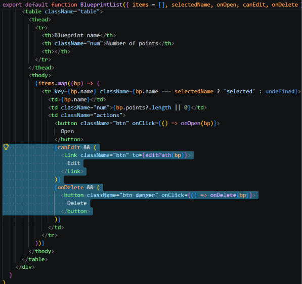

   En la tabla se agregaron los botones Edit y Delete. Edit lleva a la página para editar el plano y Delete lo borra.

   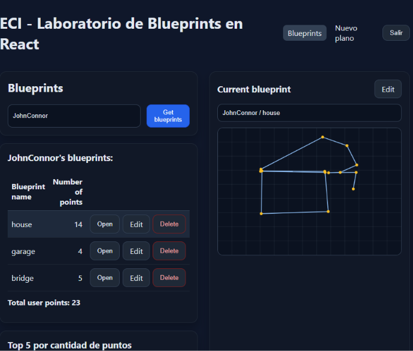

   Así se ve la tabla con la sesión iniciada. Cada plano tiene sus botones Open, Edit y Delete.

   - [ ] Optimistic updates (revertir si falla).

   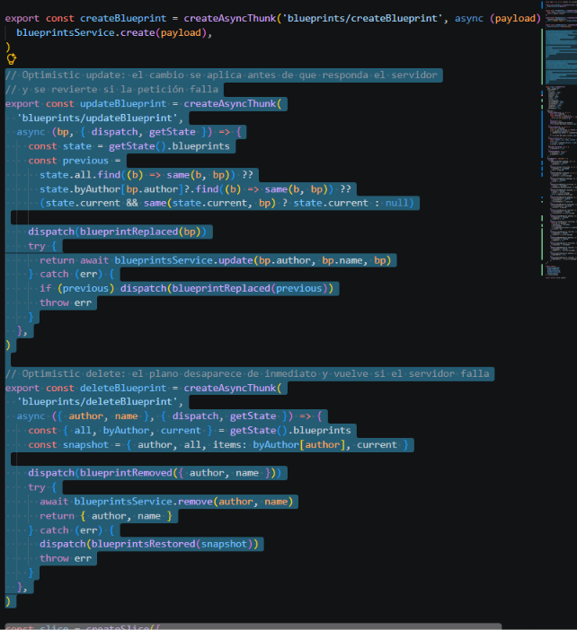

   Aquí está cómo funciona el optimistic update. Antes de pedirle el cambio al servidor se guarda una copia de cómo estaba todo y el cambio se muestra de una vez. Si el servidor falla se vuelve a poner la copia y el plano queda como antes.

   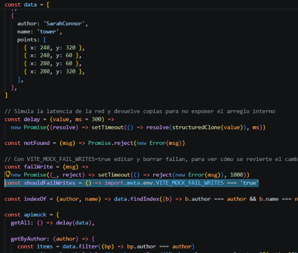

   En el servicio de prueba se agregó la opción VITE_MOCK_FAIL_WRITES. Cuando está activada, editar y borrar fallan a propósito para poder ver cómo se revierte el cambio.

   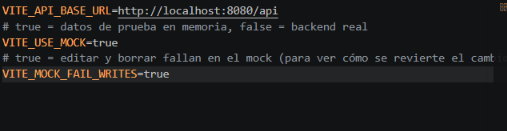

   En el archivo .env se puso VITE_MOCK_FAIL_WRITES en true para simular que el servidor falla al borrar o editar.

   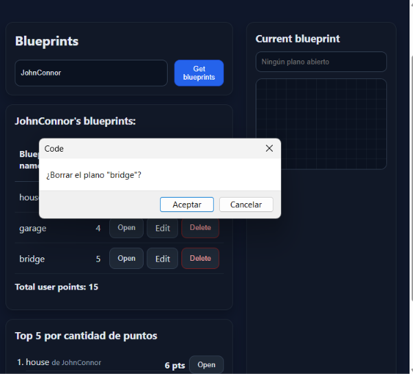

   Al dar Delete en el plano bridge sale una ventana preguntando si de verdad se quiere borrar.

   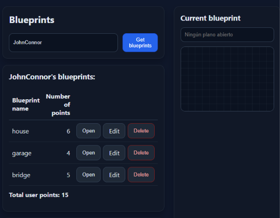

   Como el servidor falló, el plano bridge vuelve a aparecer en la tabla. El cambio se revirtió y todo quedó como estaba antes.

   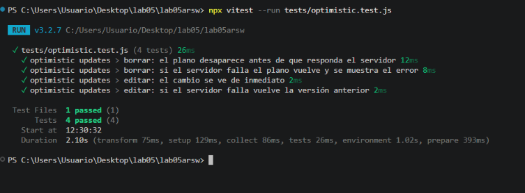

   Las pruebas del optimistic update pasan. Se revisa que al borrar o editar el cambio se vea de inmediato y que si el servidor falla todo vuelva a como estaba.

4. **Dibujo interactivo**
   - [ ] Reemplaza el `svg` por un lienzo donde el usuario haga _click_ para agregar puntos.

   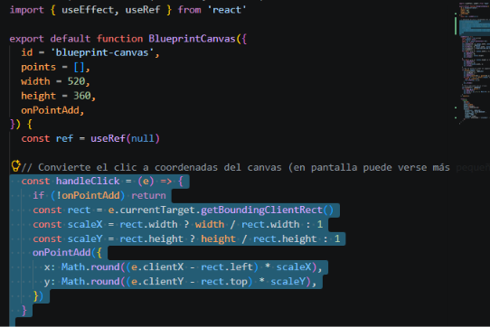

   El lienzo ahora recibe los clics del usuario. Cada clic se convierte en un punto con su posición dentro del lienzo, aunque en pantalla se vea más pequeño. Con esto se reemplazó el svg por el lienzo.

   - [ ] Botón “Guardar” que envíe el blueprint.

   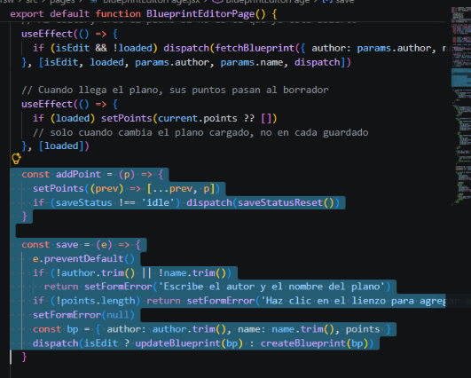

   En la página del editor, cada clic agrega un punto al dibujo. El botón Guardar revisa que haya autor, nombre y al menos un punto, y luego envía el plano.

   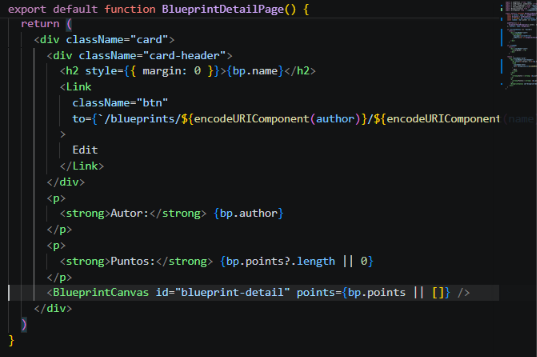

   En la página de detalle de un plano se cambió el svg por el mismo lienzo que se usa en el resto de la aplicación.

   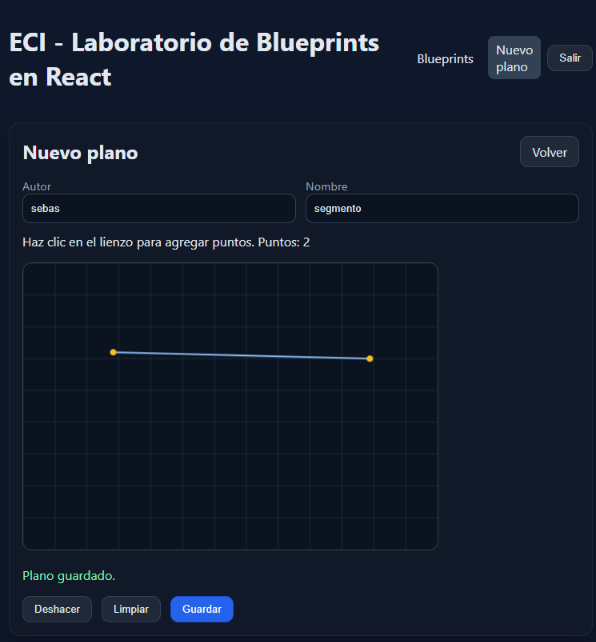

   Así se ve el editor. Se escribe el autor y el nombre, se hace clic en el lienzo para agregar puntos y al dar Guardar sale el mensaje "Plano guardado". También están los botones Deshacer y Limpiar.

   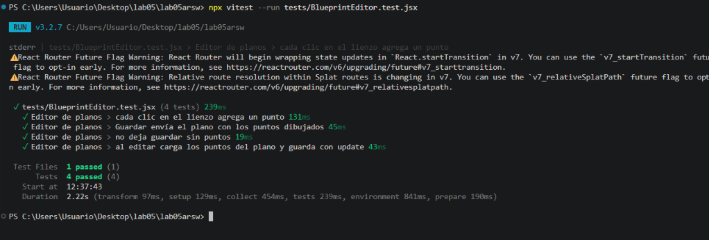

   Las pruebas del editor pasan. Se revisa que cada clic agregue un punto, que Guardar envíe el plano con sus puntos, que no deje guardar sin puntos y que al editar cargue los puntos del plano.

5. **Errores y _Retry_**
   - [ ] Si `GET` falla, muestra un banner y un botón **Reintentar** que dispare el thunk.

   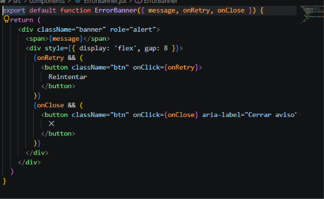

   Este es el componente del aviso de error. Muestra el mensaje y un botón Reintentar que vuelve a hacer la consulta que falló.

   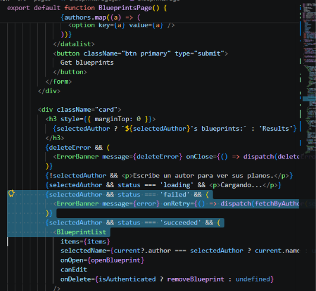

   Si falla la búsqueda de los planos de un autor aparece el aviso, y el botón Reintentar vuelve a buscar los planos de ese mismo autor.

   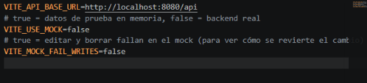

   Para probarlo se puso VITE_USE_MOCK en false, así la aplicación intenta conectarse al servidor real que no está prendido.

   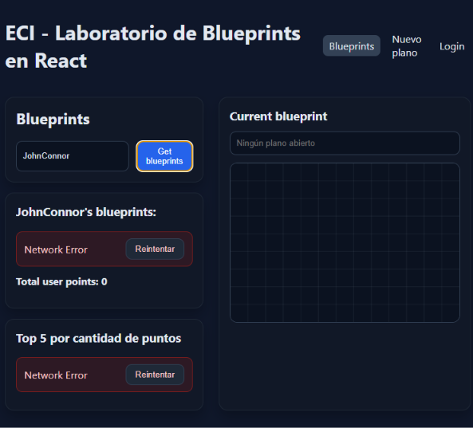

   Al buscar a JohnConnor sale el aviso "Network Error" con el botón Reintentar, tanto en la búsqueda como en el top 5.

   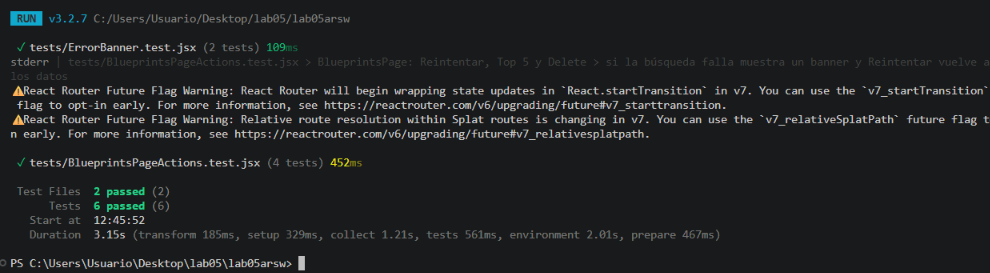

   Las pruebas del aviso de error y de Reintentar pasan. Se revisa que al dar Reintentar se vuelvan a pedir los datos.

6. **Testing**

   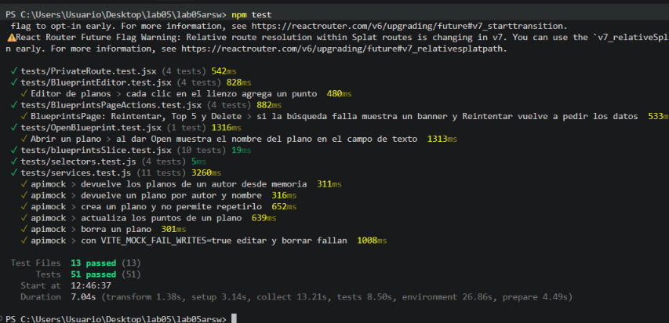

   Al correr todas las pruebas del proyecto con npm test pasan los 13 archivos y las 51 pruebas.

   - [ ] Pruebas de `blueprintsSlice` (reducers puros).

   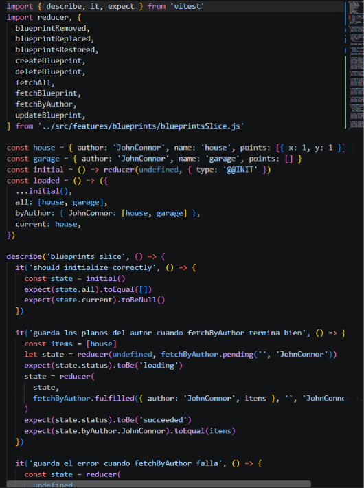

   Estas son las pruebas del slice de Redux. Revisan que cada acción deje el estado como debe quedar, por ejemplo guardar los planos, marcar la carga, guardar los errores, quitar un plano y restaurarlo.

   - [ ] Pruebas de componentes con Testing Library (render, interacción).

   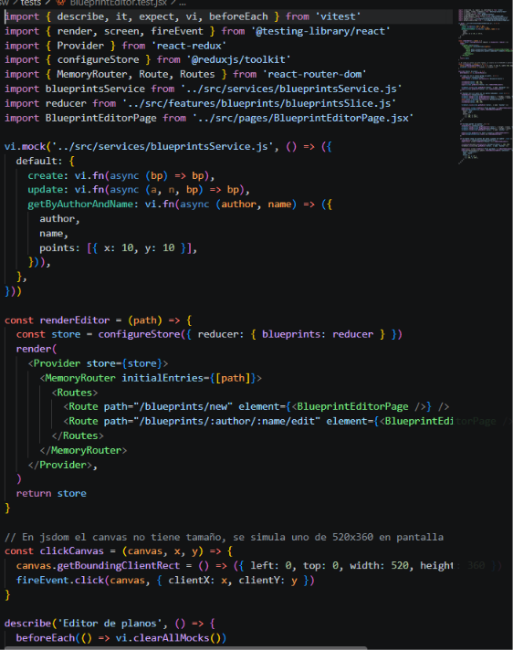

   Estas son pruebas de componentes con Testing Library. Se muestra el editor en pantalla y se simulan clics del usuario en el lienzo y en los botones para revisar que todo funcione.

7. **CI/Lint/Format**
   - [ ] Activa **GitHub Actions** (workflow incluido) → lint + test + build.

   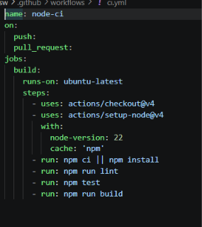

   Este es el archivo de GitHub Actions. Cada vez que se sube un cambio revisa el código con el linter, corre las pruebas y compila el proyecto.

   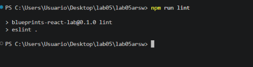

   Al correr npm run lint no sale ningún error, así que el código cumple con las reglas del proyecto.

8. **Docker (opcional)**
   - [ ] Crea `Dockerfile` (+ `compose`) para front + backend.

   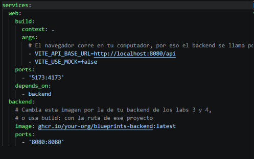

   Este es el docker-compose, que levanta el frontend y el backend juntos. Al frontend se le pasa la dirección del backend al momento de compilar.

   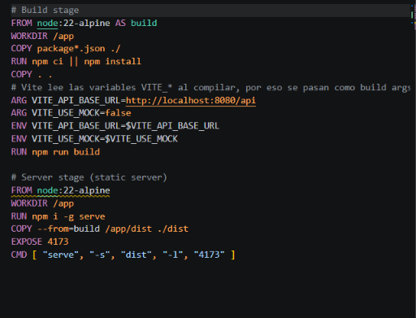

   Este es el Dockerfile. Primero instala todo y compila el proyecto, y después lo sirve con un servidor liviano. Las variables de Vite se pasan al compilar porque es en ese momento cuando se leen.

## Criterios de evaluación

- Funcionalidad y cobertura de casos (30%)
- Calidad de código y arquitectura (Redux, componentes, servicios) (25%)
- Manejo de estado, errores, UX (15%)
- Pruebas automatizadas (15%)
- Seguridad (JWT/Interceptores/Rutas protegidas) (10%)
- CI/Lint/Format (5%)

## Scripts

- `npm run dev` – servidor de desarrollo Vite
- `npm run build` – build de producción
- `npm run preview` – previsualizar build
- `npm run lint` – ESLint
- `npm run format` – Prettier
- `npm test` – Vitest

---

### Extensiones propuestas del reto

- **Redux Toolkit Query** para _caching_ de requests.
- **MSW** para _mocks_ sin backend.
- **Dark mode** y diseño responsive.

> Este proyecto es un punto de partida para que tus estudiantes evolucionen el cliente clásico de Blueprints a una SPA moderna con prácticas de la industria.
